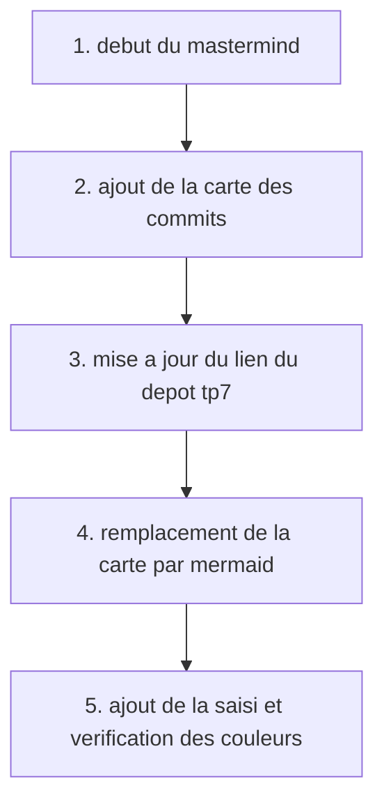

```mermaid
flowchart TD
    C1["1. debut du mastermind"]
    C2["2. ajout de la carte des commits"]
    C1 --> C2
    C3["3. mise a jour du lien du depot tp7"]
    C2 --> C3
    C4["4. remplacement de la carte par mermaid"]
    C3 --> C4
    C5["5. ajout de la saisi et verification des couleurs"]
    C4 --> C5
```
