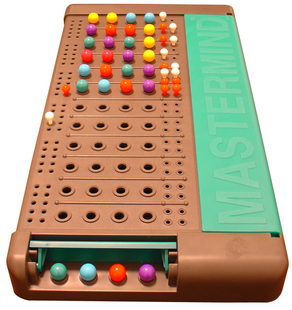
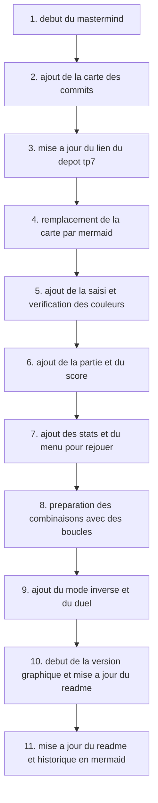

# TP7 - Mastermind

Jeu de Mastermind réalisé en Python.



## Règles

Trouver un code de 4 couleurs en 12 essais maximum.
Une couleur peut apparaître plusieurs fois.

Couleurs disponibles : R, V, B, J, M, N.

Après chaque essai :

- Correct : bonne couleur à la bonne place.
- Partiel : bonne couleur à la mauvaise place.

## Jouer

Lancer la version console :

```bash
python main.py
```

Le menu permet de jouer, consulter ses statistiques, les remettre à zéro et faire un duel contre l'ordinateur.

## Fichiers

- `main.py` : jeu console et fonctions du Mastermind.
- `mastermind_graphique.py` : début de la version graphique avec Pygame, pas encore jouable.

## Historique des commits


